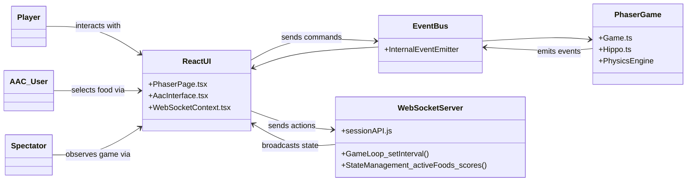

# System Block Diagram

**Figure 1**. High level design of the AAC Hungry Hippos application.

# Description

Our project is built with a modern, real-time architecture. The frontend, constructed with React and Phaser, is hosted on Vercel. This client-side application is responsible for rendering all user interfaces, including the game lobby, the AAC device, and the Phaser game canvas itself.

The backend is a central game server built with Node.js and the ws library, hosted on Railway. This server manages the entire game state, including player scores, positions, and the synchronized spawning and movement of all food items. For production, it uses a PostgreSQL database, also on Railway, to persist session and player data.

All real-time communication between the client and server is handled via a persistent WebSocket connection. The client sends user actions (like joining a game or selecting a food), and the server broadcasts the game state back to all connected players, ensuring that everyone's game is perfectly synchronized, even if a player's browser tab becomes inactive.

All user types-Player, AAC User, and Spectator connect through the same frontend application, receiving a role-specific experience that is controlled and synchronized by the central backend server.