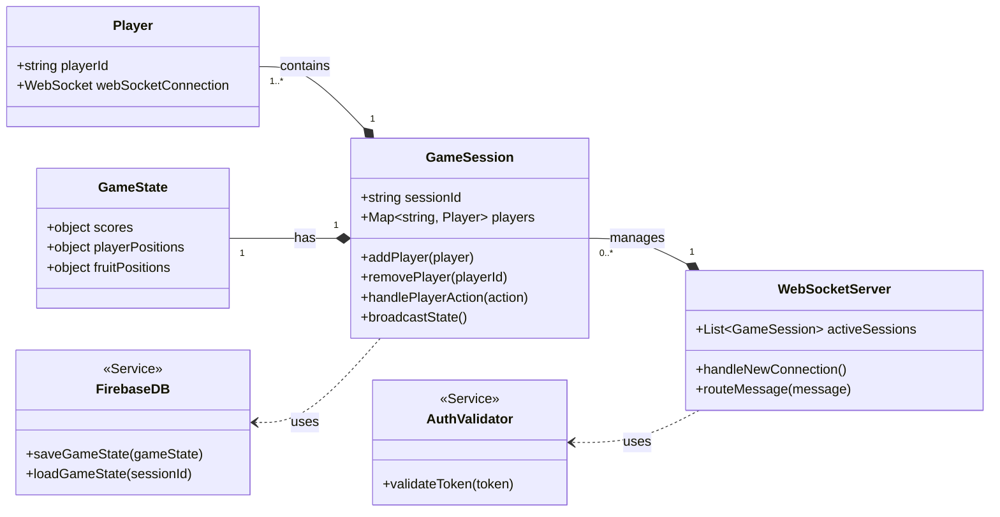
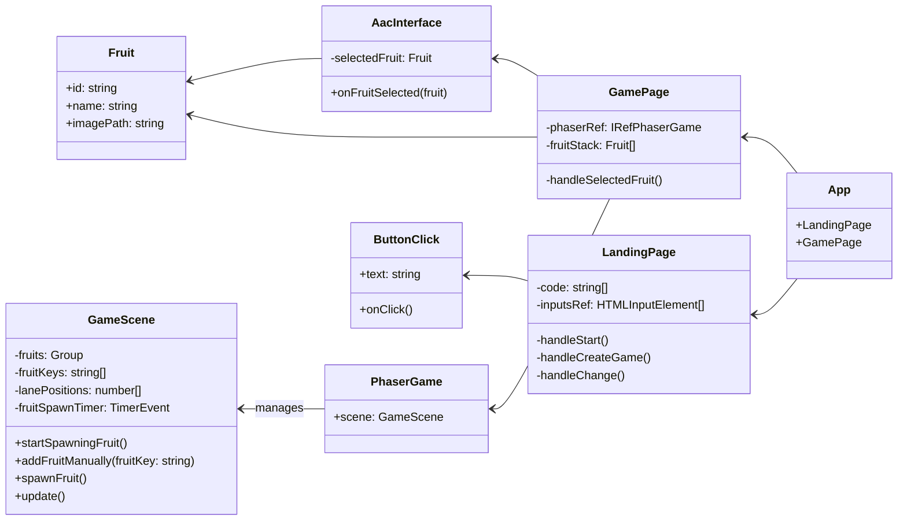

# Class Diagrams

**Note this project still being completed so parts of front and backend documentation are not completely finished**

## Backend

### Relationships
This diagram illustrates the architecture of our backend services.

The primary entry point is the WebSocketServer, which is responsible for managing all active game rooms. For each game, it creates and holds a GameSession instance.

Each GameSession then contains the list of connected Player objects and is composed of a GameState object, which tracks live data like scores and positions. To ensure security, the WebSocketServer uses an AuthValidator service to verify players when they first connect. During gameplay, the GameSession uses the FirebaseDB service to save and load the game's state, ensuring data is persisted.

## Frontend

### Relationships

This diagram illustrates the architecture of our frontend.

The frontend of the game is built with React and Phaser, structured into key pages and components. The App component handles routing between the LandingPage and GamePage. On the LandingPage, users can join or create a game. The GamePage displays both the AAC interface—where users select fruits—and the game area powered by Phaser. The selected fruit is sent to the PhaserGame, which triggers falling fruit animations. Game logic, including asset loading and physics, is managed in the GameScene class. This setup cleanly separates UI and game logic, supporting accessibility and smooth interaction.
