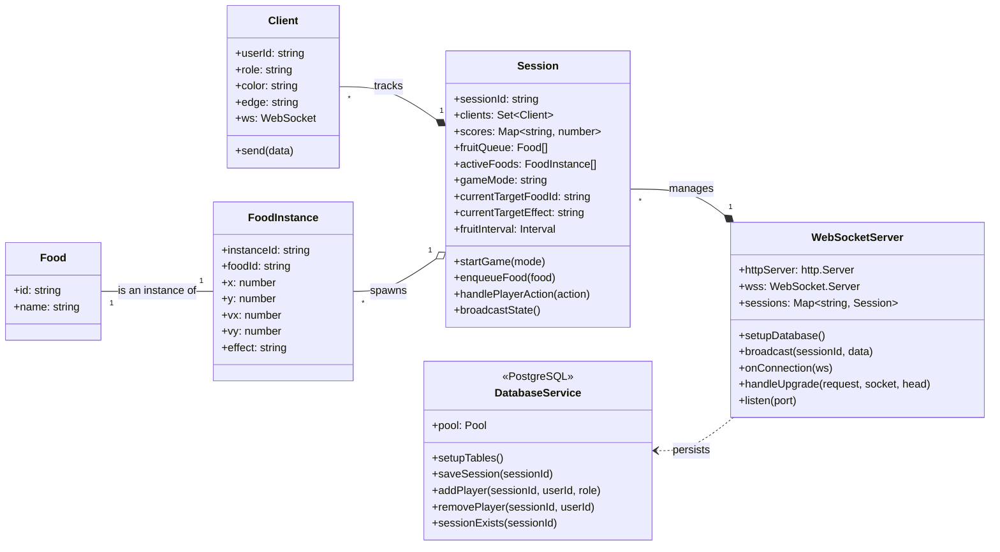

# Class Diagrams

## Backend

**Figure 1.** This diagram illustrates the architecture of our current backend service.

### Relationships

The primary entry point is the WebSocketServer, which is responsible for managing all active game rooms. For each game, it creates and holds a Session instance.

Each Session encapsulates the entire state and logic for a single game. It contains the set of connected Client objects and tracks all activeFoods, the fruitQueue, and player scores. The startGame and handlePlayerAction methods contain the core game logic, and a central game loop broadcasts the state to all players. A FoodInstance represents a specific food item currently on screen, with its own position and velocity. Each FoodInstance is an instance of a static Food object, which simply holds the food's name and ID.

For production, the WebSocketServer uses the DatabaseService to save and load session and player data, ensuring data is persisted.

## Frontend

### Relationships

This diagram illustrates the architecture of our frontend.

The frontend of the game is built with React and Phaser, structured into key pages and components. The App component handles routing between the LandingPage and GamePage. On the LandingPage, users can join or create a game. The GamePage displays both the AAC interface—where users select fruits—and the game area powered by Phaser. The selected fruit is sent to the PhaserGame, which triggers falling fruit animations. Game logic, including asset loading and physics, is managed in the GameScene class. This setup cleanly separates UI and game logic, supporting accessibility and smooth interaction.
