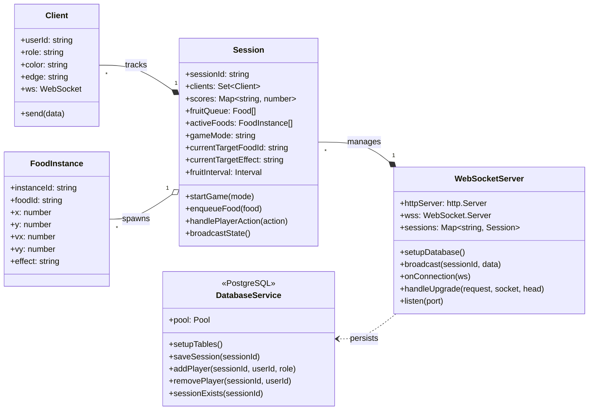
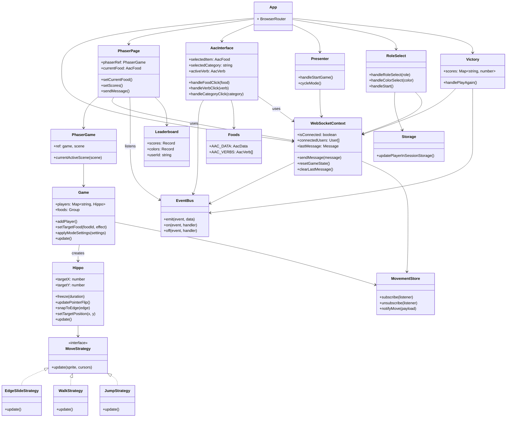

# Class Diagrams

## Backend

**Figure 1.** This diagram illustrates the architecture of our current backend service.

### Relationships

The primary entry point is the WebSocketServer, which is responsible for managing all active game rooms. For each game, it creates and holds a Session instance.

Each Session encapsulates the entire state and logic for a single game. It contains the set of connected Client objects and tracks all activeFoods, the fruitQueue, and player scores. The startGame and handlePlayerAction methods contain the core game logic, and a central game loop broadcasts the state to all players. A FoodInstance represents a specific food item currently on screen, with its own position and velocity. Each FoodInstance is an instance of a static Food object, which simply holds the food's name and ID.

For production, the WebSocketServer uses the DatabaseService to save and load session and player data, ensuring data is persisted.

## Frontend

### Relationships

Starts at the App component, which wraps the entire application in a WebSocketProvider and defines the routing for all gameplay views. Each route represents a distinct user page tied to the player's current role in the session.

PhaserPage mounts the PhaserGame wrapper, which instantiates the Game scene which manages game physics, player movement, collision, and food effects. Each player is represented by a Hippo object, whose movement behavior is controlled by MoveStrategy implementations like EdgeSlideStrategy, WalkStrategy, or JumpStrategy.

Communication between components and game is done through the EventBus and WebSocketContext, which listen for updates and synchronizes state across the network. The MovementStore allows syncing of player position. The Foods module provides access to the AAC vocabulary, while Storage handles session reloads. UI components like Leaderboard, Victory give feedback tied to game state.
