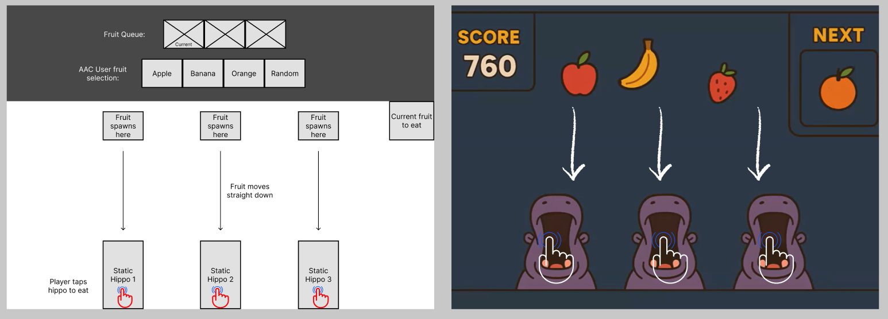
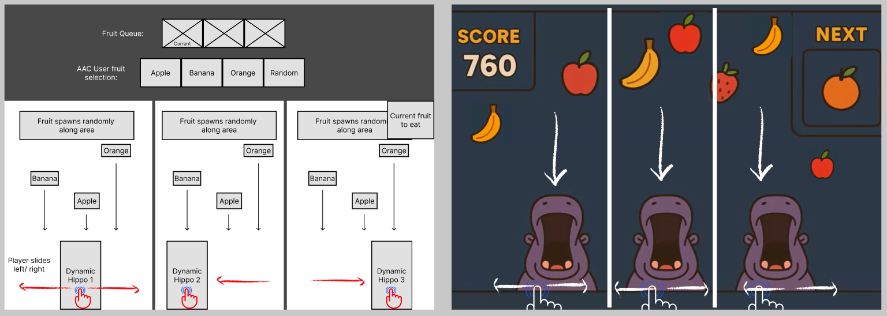
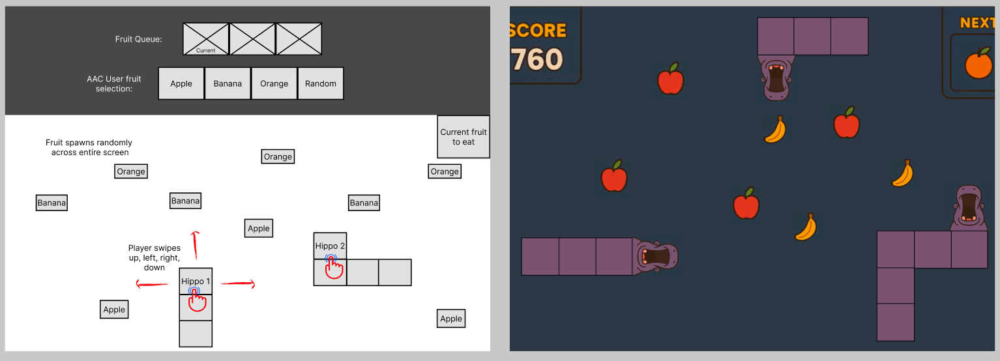
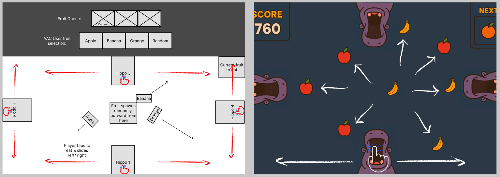
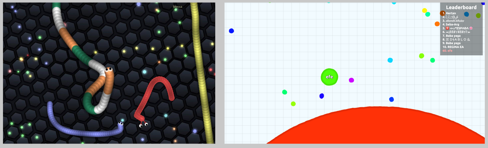
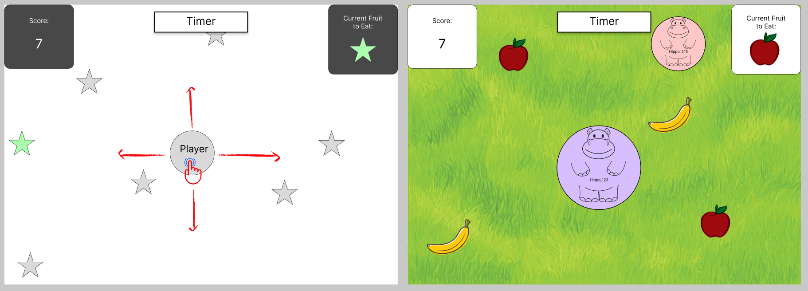

# Mockups (Gameplay Design)

This section presents the low-fidelity and high-fidelity game design mockups for the game, created in Figma. These mockups explore different styles for an engaging, AAC-compatible multiplayer experience. Stakeholder, team conclusions, and final gameplay design mockup are also included.

> All mockups are available for preview in the [[Figma project link](https://www.figma.com/design/kF9uAD0Apu4SL2jEjisWbQ/AAC-Hungry-Hippo?node-id=212-279&t=vFsFYqKEPL8jwgvC-1)].

---

## 1. **Static Hippos + Tap to Eat**

  
**Left:** Low-Fidelity  **Right:** High-Fidelity

- **Gameplay Overview**:  
  Hippos remain stationary. Fruits spawn directly on top of hippo. Players must tap to open their hippo's mouth when a fruit approaches. An AAC (Augmentative and Alternative Communication) user defines the target fruit (e.g., “Only apples”), and players must respond accordingly by tapping to eat or ignoring other fruits.

- **Accessibility Note**:  
  AAC-driven fruit selection ensures inclusive gameplay by allowing a non-tapping participant to set the game rules.

- **Potential Challenges**:  
  - May become repetitive over time  
  - Limited competitive dynamics due to lack of movement

---

## 2. **Responsive Hippos – Split Screen**

  
**Left:** Low-Fidelity  **Right:** High-Fidelity

- **Gameplay Overview**:  
  Each player is assigned a distinct zone on the screen. Each player can slide their hippo left/right. Fruits rain down randomly across width of entire screen. The AAC user sets the fruit target, and players respond within their own space without direct interference from others.

- **Accessibility Note**:  
  Isolates player interaction zones, reducing confusion or accidental conflict. Good for cooperative or parallel competitive play.

- **Potential Benefits**:  
  - Easier to scale for multiple players  
  - Reduces visual and input clutter
  - More interesting gameplay for player

---

## 3. **Snake-Style Hippo Game**

  
**Left:** Low-Fidelity  **Right:** High-Fidelity

- **Gameplay Overview**:  
  Hippos are mobile and can roam freely across tetris styled board, similar to the classic Snake game. Fruits are scattered randomly instead of falling. Players must navigate to collect AAC-selected fruit and other random fruits.

- **Potential Challenges**:  
  - Significantly more complex to implement  
  - Game design is very different from Hungry Hippos game

---

## 4. **Hungry Hungry Hippos Replica– Exclusive Screen Sides**

  
**Left:** Low-Fidelity  **Right:** High-Fidelity

- **Gameplay Overview**:  
  Each hippo occupies an exclusive side of the screen (top, bottom, left, or right). The AAC user selects both a fruit type and the direction it will launch from the center. Hippos slide along their respective edges to catch or avoid fruits.

- **Accessibility Note**:  
  Combines movement, direction, and AAC-defined rules in a compact design. Encourages anticipation and reaction timing.

- **Potential Challenges**:  
  - Requires precise coordination of fruit direction and hippo motion  
  - Max of 4 players
  - Complexity to display of each player's screen

---

## Stakeholder Feedback

During discussions with stakeholders of the 4 different mockups, a few key points came up that influence how we think about the game design moving forward:

- **Screen size becomes a problem with multiple players**  
  Some of the mockups assume all players share the same screen space. But when imagining a full game with 4+ players, the screen could quickly become too crowded. That makes it harder to see and react, especially on tablets or smaller devices.

- **Players don’t need to see each other’s hippos**  
  Stakeholders felt it wasn’t necessary for each player to see all other players’ hippos on their screen. This simplifies the interface and helps players stay focused on their own actions.

- **Only the Snake Game avoids these issues**  
  Most of the game concepts are affected by these limitations except for the Snake-style game. Because it allows each player to move around freely in a shared space without needing to track others visually, it avoids both screen clutter and scalability concerns.

- **The Snake Game is the most inclusive**  
  Overall, stakeholders felt the Snake-style design was the most inclusive and accessible. It supports different levels of motor ability, works well with AAC-based decision-making, and is flexible for both small and large groups.

---

## Final Gameplay Design

After reviewing all mockups and incorporating stakeholder feedback, we decided to move forward with a design based on the Snake Game concept.

  
**Left:** Slither.io  **Right:** Agario.io

Initially, we looked to the web game Slither.io for inspiration, particularly its free movement mechanics and real time multiplayer interaction. However, players snakes get longer after eating a fruit. We wanted to stay true to the hippo theme, and shifted our reference to Agar.io, which features circular avatars rather than long snake bodies. The circular avatars increase in size. We would also implement our own features.

  
**Left:** Low-Fidelity  **Right:** High-Fidelity (not final deign)

### Key Design Choices:

- **Gameplay Overview**:  
  Hippos are mobile and can roam freely across the board, similar to the classic Snake game. Fruits are scattered randomly instead of falling. Players must navigate to collect AAC-selected fruit and other random fruits.

- **Hippo Representation**:  
  Players will control circular hippo avatars that roam the play area, similar to Agar.io.

- **AAC Integration**:  
  The game will still center around AAC-based fruit selection, where one player sets the target fruit, and others aim to collect that item.

- **Movement & Interaction**:  
  Players can freely move their hippos around the screen to collect target fruits scattered throughout the space.

- **Multiplayer Simplicity**:  
  Using circular avatars allows for cleaner visuals and more scalable gameplay, especially with larger player counts.

This direction preserves the inclusivity and flexibility of the Snake-style gameplay while reinforcing the visual identity of hippos eating fruit in a way that’s friendly and accessible.
