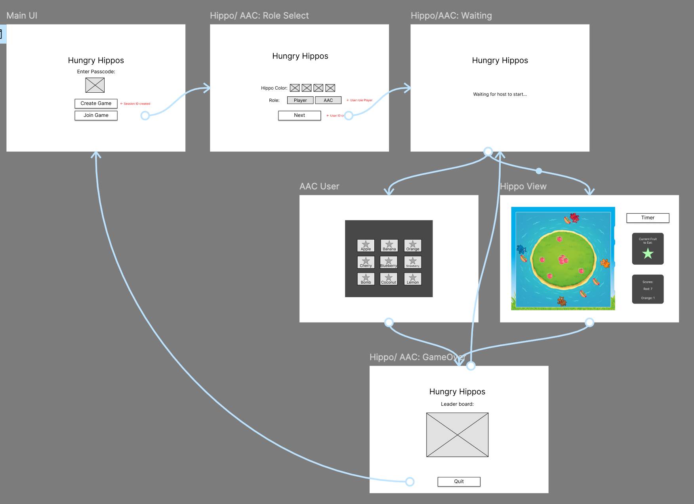
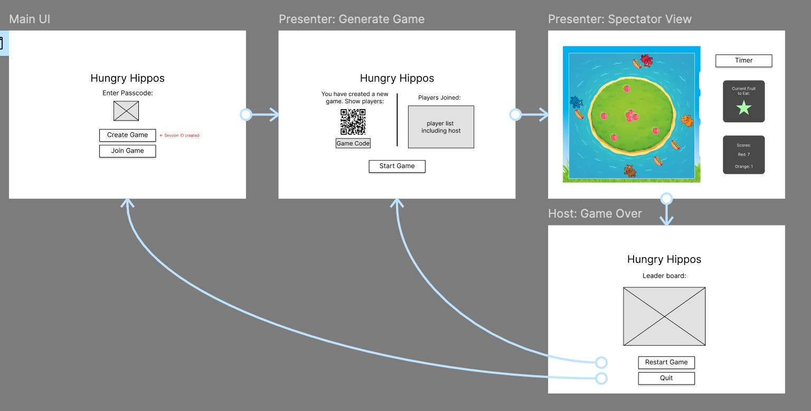

# Prototypes

## Introduction

This will include interactive links of the flow of our game through multiple interations, as well as feedback.

[Figma project link](https://www.figma.com/design/kF9uAD0Apu4SL2jEjisWbQ/AAC-Hungry-Hippo?node-id=0-1&t=au7YeBmwC49zFNfY-1)

---

## Prototype 1 – Static Hippos (Tap to Eat)

  
Low-fidelity with static hippo game design

[Prototype 1 link](https://www.figma.com/proto/kF9uAD0Apu4SL2jEjisWbQ/AAC-Hungry-Hippo?node-id=124-271&t=VaXs0PsfLlyqxJlq-1&scaling=min-zoom&content-scaling=fixed&page-id=0%3A1&starting-point-node-id=124%3A271&show-proto-sidebar=1)

**Gameplay Overview:**  
The first prototype used a simple game mechanic where hippos were stationary, and fruits fell from the top of the screen. Players tapped to open their hippo’s mouth to eat fruits. The AAC user selected a target fruit (e.g., "Only apples"), and players reacted by trying to eat only that fruit and ignoring the others. This also included the interface of game logic such as: when a hippo would eat a correct/ wrong fruit. Also how the fruit queue system worked, and if there was nothing in the queue. 

**Stakeholder Feedback:**

- Stakeholders were confused about why both the AAC interface and the player interface appeared on the same screen.
- We explained that this was only for demonstration purposes during development.
- In the final implementation, the AAC user and player will have separate interfaces, either on different devices or distinct screens.
- Had concerns about overall game design, spacing of screen, scalability. More details under "Mockups" section. 

---

## Prototype 2 – Agar.io-Inspired Free Movement

  
Low-fidelity host/ player screen

[Prototype 2 link (host/ hippo player)](https://www.figma.com/proto/kF9uAD0Apu4SL2jEjisWbQ/AAC-Hungry-Hippo?node-id=124-112&t=TVFKCTatV7IWFwvH-1&scaling=min-zoom&content-scaling=fixed&page-id=0%3A1&starting-point-node-id=124%3A112&show-proto-sidebar=1)

  
Low-fidelity AAC user screen

[Prototype 2 link (AAC User)](https://www.figma.com/proto/kF9uAD0Apu4SL2jEjisWbQ/AAC-Hungry-Hippo?node-id=124-174&t=OPHLFdZI4dztkARE-1&scaling=min-zoom&content-scaling=fixed&page-id=0%3A1&starting-point-node-id=233%3A510&show-proto-sidebar=1)

**Gameplay Overview:**  
For the second prototype, we shifted to a design inspired by Agar.io. Players control circular hippos that can move freely around the screen. Fruits are scattered across the board, and players must navigate to collect the AAC-designated fruit type. There are 2 roles.

For agario host/ hippo player flow:
- The first hippo also recieves the role of Host. They create the game, start the game, then see their game screen, then leaderboard, game restarts and loads back to "Generate Game" slide.

For agario aac flow:
- Same flow as first example, except AAC is in waiting room before host starts game.

**Stakeholder Feedback:**

- Stakeholders liked how gameplay was more "fun"
- Adding "Username" was not needed
- Stakeholders raised the question of how a person would choose their role in the game.
- We suggested adding a "Choose Your Role" screen where users select whether they are an AAC user or a regular player.
- Stakeholders agreed to consider this approach and will provide feedback on whether this role-selection method is appropriate for their use case.
- Stakeholders wanted more focus on intergration of AAC user/ device over the players.

---

## Prototype 3 – Hungry Hippo Replica

  
Low-fidelity Presenter screen

[Prototype 3 link (presenter)](https://www.figma.com/proto/kF9uAD0Apu4SL2jEjisWbQ/AAC-Hungry-Hippo?node-id=292-379&t=xn9T5hLnT9bVFLPG-1&scaling=min-zoom&content-scaling=fixed&page-id=0%3A1&starting-point-node-id=292%3A379&show-proto-sidebar=1)

  
Low-fidelity AAC user and Hippo screen

[Prototype 3 link (AAC User/ Hippo)](https://www.figma.com/proto/kF9uAD0Apu4SL2jEjisWbQ/AAC-Hungry-Hippo?node-id=292-527&t=mah798lHJvRSkYQR-1&scaling=min-zoom&content-scaling=fixed&page-id=0%3A1&starting-point-node-id=292%3A527&show-proto-sidebar=1)

**Gameplay Overview:**  
For the third prototype, we shifted to a design inspired by the actual Hungry Hippos game. Players control hippos that can move along their edge of the screen. Fruits spawned from the center and move outwards towards players, and players must navigate to collect the AAC-designated fruit type. There are 3 roles.

For presenter flow:
- They create the game, wait for users to join, can edit game mode, start the game, see spectator game screen, then leaderboard scores when timer ends, can restart game to load back to "Generate Game" slide.

For hippo flow:
- They can join game, choose hippo color, see waiting room (host has not started game yet), Hippo game view, then leaderboard scores when timer ends, back to waiting room if presenter restarts game. Repeat.

For AAC flow:
- They can join game, choose AAC role, see waiting room (host has not started game yet), view AAC board, then leaderboard scores when timer ends, back to waiting room if presenter restarts game. Repeat.

**Stakeholder Feedback:**

- Stakeholders liked how there is now a presenter view. This gives power to AAC user who can look at this while playing.
- Liked how hippo players can see everyone else while in game
- concerns over queue system of AAC and displaying the queue
- If AAC users can spam fruits, delays with buttons
- Do not use dropdowns as they are not user friendly
- Remove as much text as possible, use images as much as possible.
- Add audio feedback

