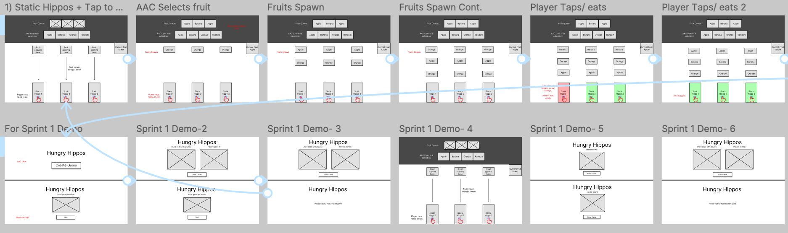
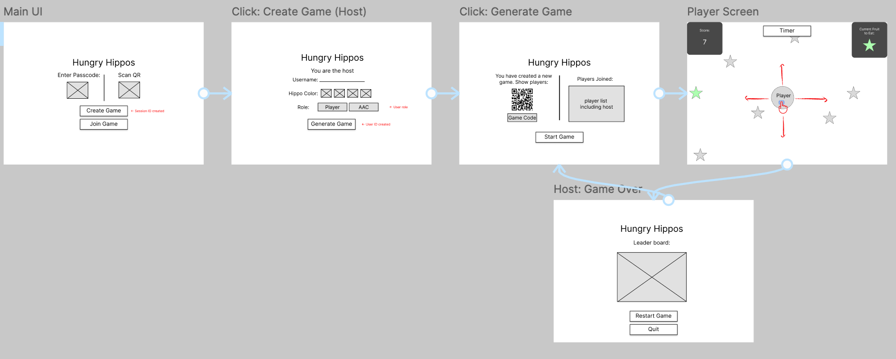
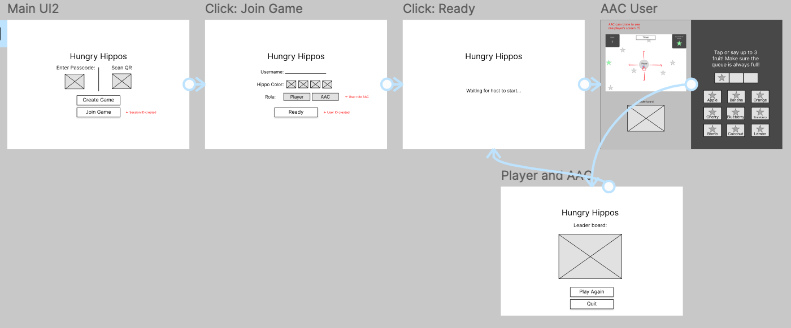

# Prototypes

## Introduction

This will include interactive links of the flow of our game through multiple interations, as well as feedback.

[Figma project link](https://www.figma.com/design/kF9uAD0Apu4SL2jEjisWbQ/AAC-Hungry-Hippo?node-id=212-279&t=vFsFYqKEPL8jwgvC-1)

---

## Prototype 1 – Static Hippos (Tap to Eat)

  
Low-fidelity with static hippo game design

[Prototype 1 link](https://www.figma.com/proto/kF9uAD0Apu4SL2jEjisWbQ/AAC-Hungry-Hippo?node-id=124-271&t=VaXs0PsfLlyqxJlq-1&scaling=min-zoom&content-scaling=fixed&page-id=0%3A1&starting-point-node-id=124%3A271&show-proto-sidebar=1)

**Gameplay Overview:**  
The first prototype used a simple game mechanic where hippos were stationary, and fruits fell from the top of the screen. Players tapped to open their hippo’s mouth to eat fruits. The AAC user selected a target fruit (e.g., "Only apples"), and players reacted by trying to eat only that fruit and ignoring the others. This also included the interface of game logic such as: when a hippo would eat a correct/ wrong fruit. Also how the fruit queue system worked, and if there was nothing in the queue. 

**Stakeholder Feedback:**

- Stakeholders were confused about why both the AAC interface and the player interface appeared on the same screen.
- We explained that this was only for demonstration purposes during development.
- In the final implementation, the AAC user and player will have separate interfaces, either on different devices or distinct screens.
- Had concerns about overall game design, spacing of screen, scalability. More details under "Mockups" section. 

---

## Prototype 2 – Agar.io-Inspired Free Movement

  
Low-fidelity host/ player screen

[Prototype 2 link (host/player)](https://www.figma.com/proto/kF9uAD0Apu4SL2jEjisWbQ/AAC-Hungry-Hippo?node-id=124-112&t=TVFKCTatV7IWFwvH-1&scaling=min-zoom&content-scaling=fixed&page-id=0%3A1&starting-point-node-id=124%3A112&show-proto-sidebar=1)

  
Low-fidelity AAC user screen

[Prototype 2 link (AAC User)](https://www.figma.com/proto/kF9uAD0Apu4SL2jEjisWbQ/AAC-Hungry-Hippo?node-id=124-174&t=OPHLFdZI4dztkARE-1&scaling=min-zoom&content-scaling=fixed&page-id=0%3A1&starting-point-node-id=233%3A510&show-proto-sidebar=1)

**Gameplay Overview:**  
For the second prototype, we shifted to a design inspired by Agar.io. Players control circular hippos that can move freely around the screen. Fruits are scattered across the board, and players must navigate to collect the AAC-designated fruit type.

**Stakeholder Feedback:**

- Stakeholders liked how gameplay was more "fun"
- Adding "Username" was not needed
- Stakeholders raised the question of how a person would choose their role in the game.
- We suggested adding a "Choose Your Role" screen where users select whether they are an AAC user or a regular player.
- Stakeholders agreed to consider this approach and will provide feedback on whether this role-selection method is appropriate for their use case.
- Stakeholders wanted more focus on intergration of AAC user/ device over the players.

---
