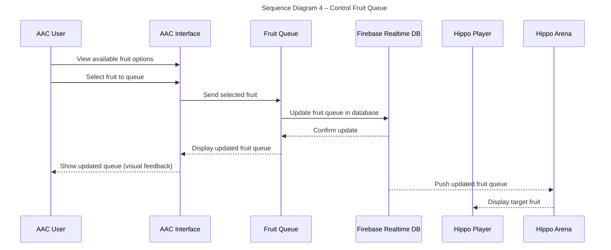
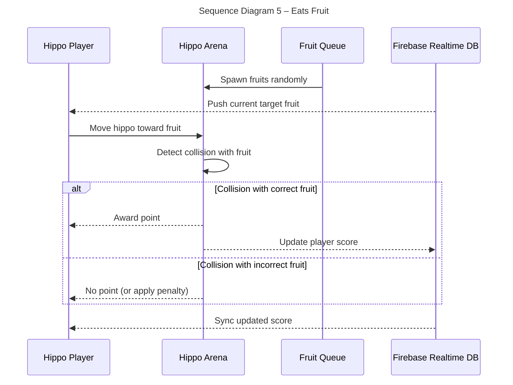

# Sequence Diagrams

## Use Case 4 – Control Fruit Queue (AAC User)

*As an AAC user, I want to control the next three fruits in the queue so that I can challenge players.*

1. During gameplay, the AAC interface shows options for fruits to appear.
2. The AAC user selects the next fruit from a set of fruit buttons.
3. The selected fruit is queued to drop into the play area.
4. The next 1 fruit are visible on screen to all players.

## Use Case 5 – Eats Fruit (Player)

*As a player, I want to move my hippo around the arena and eat the correct fruit so that I can earn points.*

1. Fruits spawn and are placed randomly across the arena in real time.
2. The player watches the displayed queue to know which fruit is “correct.”
3. The player moves their hippo toward fruits on the arena.
4. If correct, a point is awarded.
5. If incorrect, no point is awarded (or a penalty is applied).

