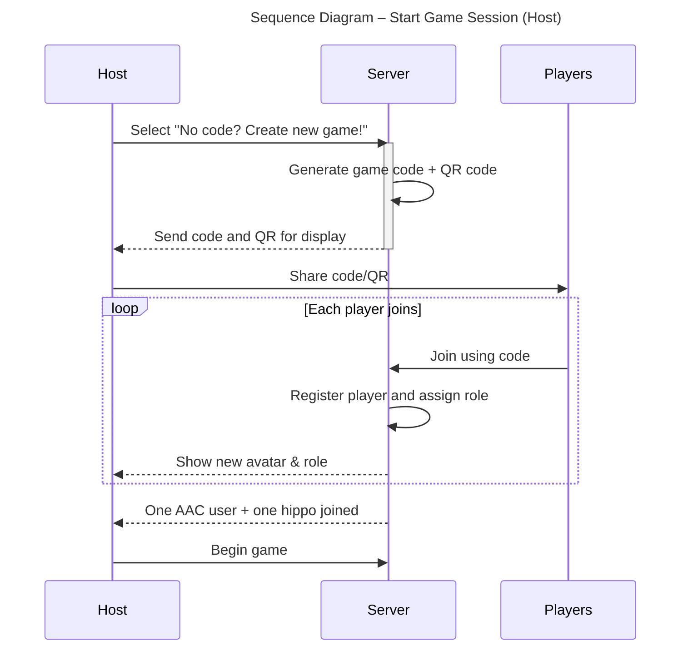
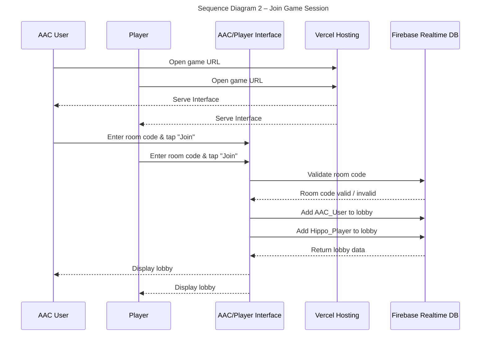
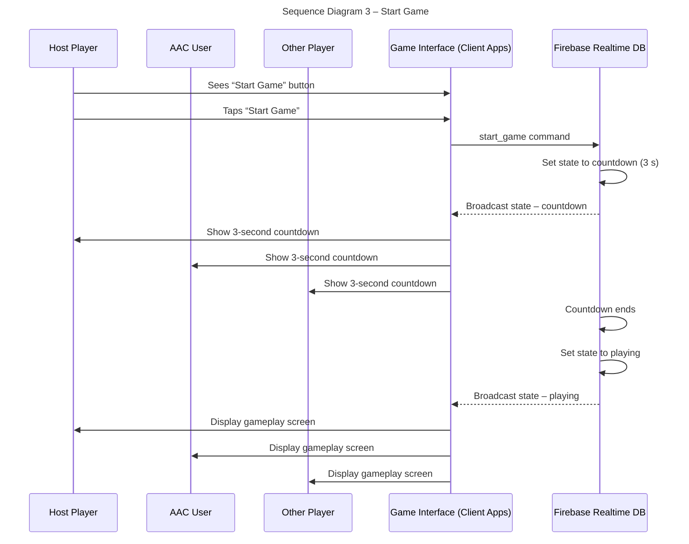
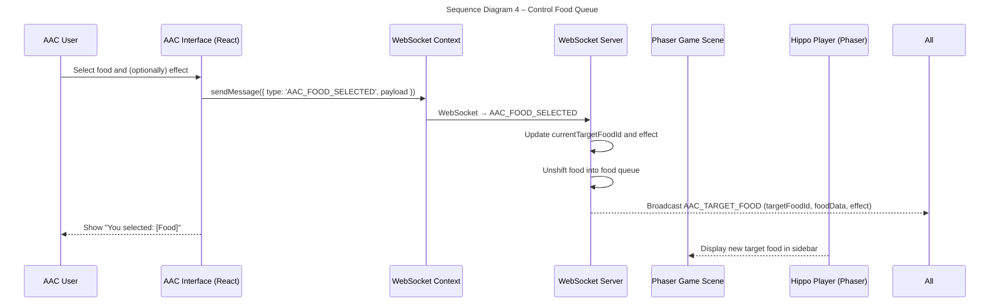
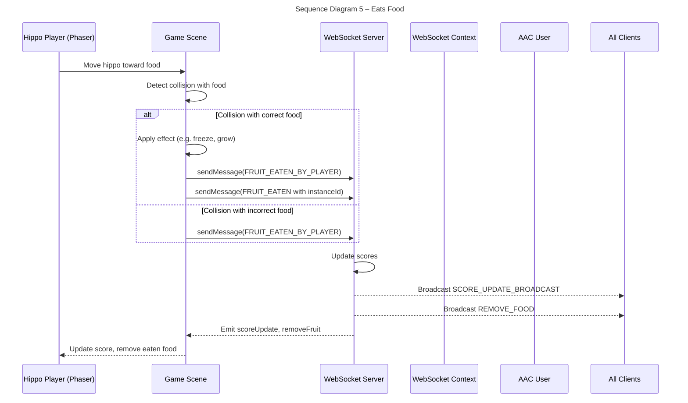
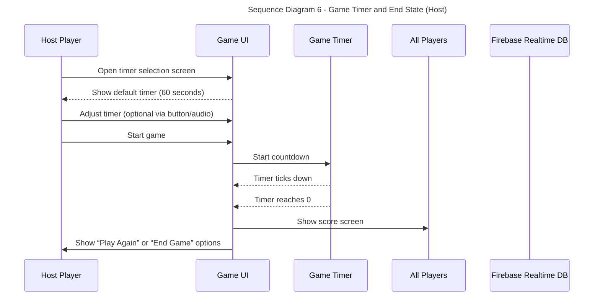
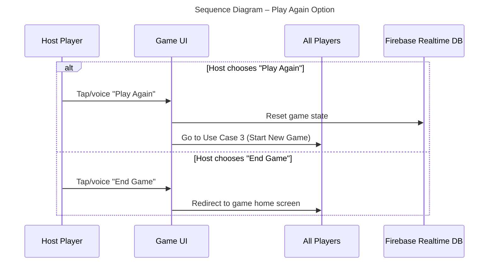

# Sequence Diagrams

## Use Case 1 - Start Game Session (Host)
*As a host, I want to initiate a new game session from my device, so that players can join.*
1. The host opens the game and chooses to start a new session.
2. A unique game code and QR code is created and shown on their screen.
3. The host shares this code (or QR code) with those who want to join.
4. As players join the game, their hippo avatars and roles appear on the host’s screen.
5. Once at least one AAC user and one hippo player have joined, the host can begin the game.inputs.
    

## Use Case 2 – Join Game Session (Player or AAC User)
*As a player or AAC User, I want to join a game session using a code so that I can play the game.*

1. A player opens the game/ website on their device.
2. They enter the room code or use the audio provided by the host.
3. They tap “Join Game” or use audio.
4. Once the code is accepted, they are added to the game lobby.
5. The player waits until the host starts the game.

## Use Case 3 – Start Game (Host)
*As a host, I want to start the game after players have joined so that everyone can begin playing.*

1. The Host Player sees a "Start Game" button on their game interface.
2. The Host Player taps "Start Game".
3. The Host Player's interface sends a command to Firebase to start the game.
4. Firebase updates the central game state to begin a 3-second countdown.
5. All connected player interfaces (Host, AAC User, and other players) receive the updated game state and switch to a gameplay screen, displaying the countdown.
6. When the countdown ends, the game officially starts, and gameplay begins on all connected screens.

## Use Case 4 – Control Food Queue (AAC User)

*As an AAC user, I want to control the food in the queue so that I can challenge players.*

1. During the game, the AAC user sees a menu of foods they can pick from.
2. They tap the foods they want the other players to go after.
3. They can also choose a special effect, like Freeze or Grow
4. The foods they picked becomes the new target for all the hippos playing.
5. The chosen food appears on screen, and players try to catch it with their hippos.

## Use Case 5 – Eats Food (Player)

*As a player, I want to move my hippo on my side and eat the correct food so that I can earn points.*

1. Food spawn out from the center of the screen toward each hippo player.
2. The screen shows which food the AAC user has selected as the target.
3. The player moves their hippo along their edge of the screen to try to catch that food.
4. If they catch the correct food, they earn a point — and may receive a bonus effect like growing bigger.
5. If they catch the wrong food, they may lose a point or trigger a penalty like being frozen.
6. The game continues until the timer runs out.

## Use Case 6 – Game Timer and End State (Host)
*As a player or AAC user, I want the game to end automatically after 1 minute so we know when the round is over.*

1. The host sees a timer selection screen.
2. There is a 60-second default timer. The host can use buttons or audio to change the time.
3. The host starts the game. See User Case 3.
4. When the timer reaches 0, the game ends.
5. A score screen is shown to all players.
6. The host sees a “Play Again” or “End Game” option.

## Use Case 7 – Play Again (AAC User or Player)
*As an AAC user or player, I want to play another game session after a round ends.*

1. After the game ends, if the host taps or uses audio to “Play Again”, go to Use Case 3.
2. If the host taps or uses audio to “End Game”, all users are redirected to the game homescreen.

