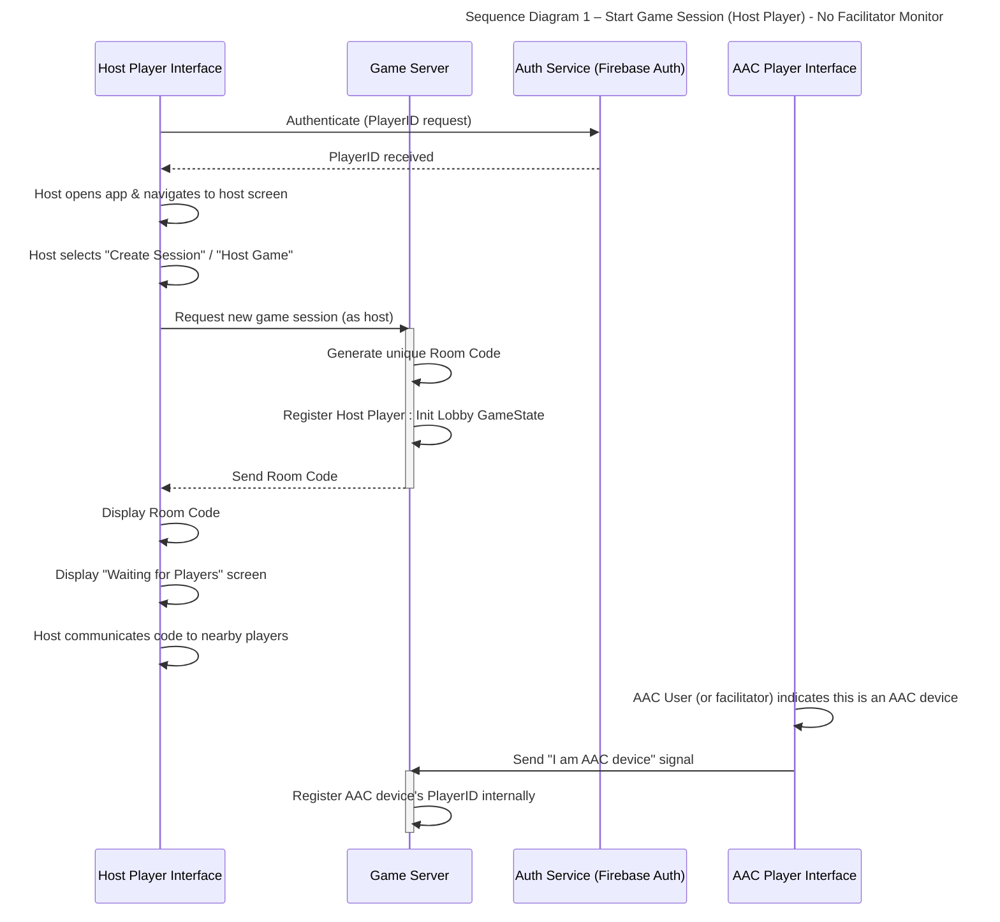
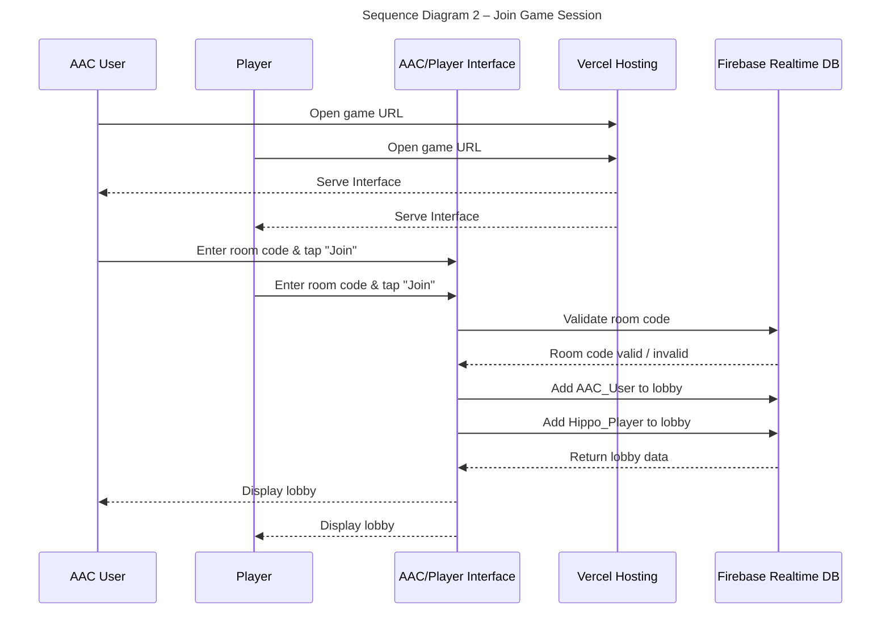
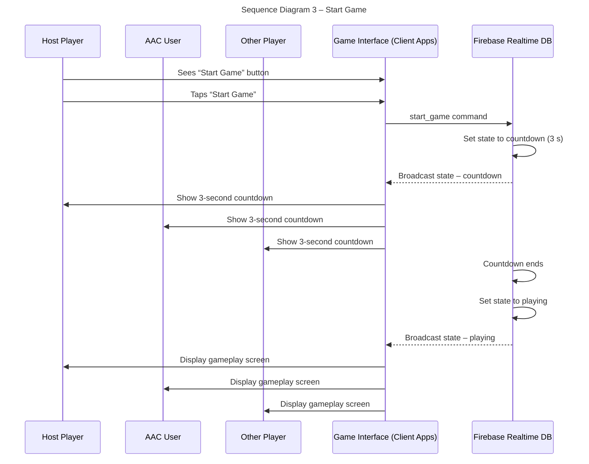
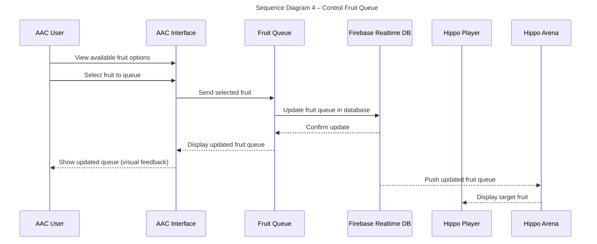
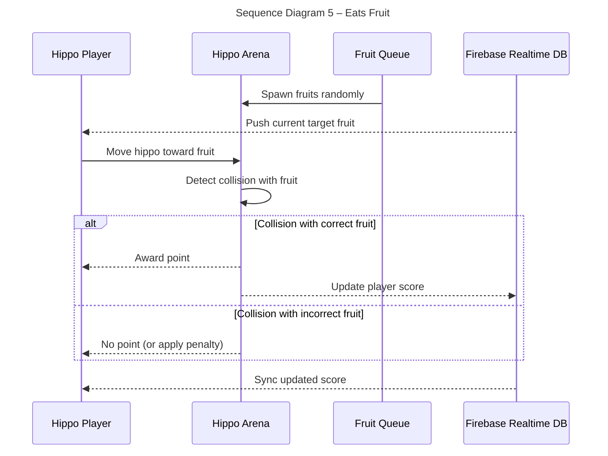
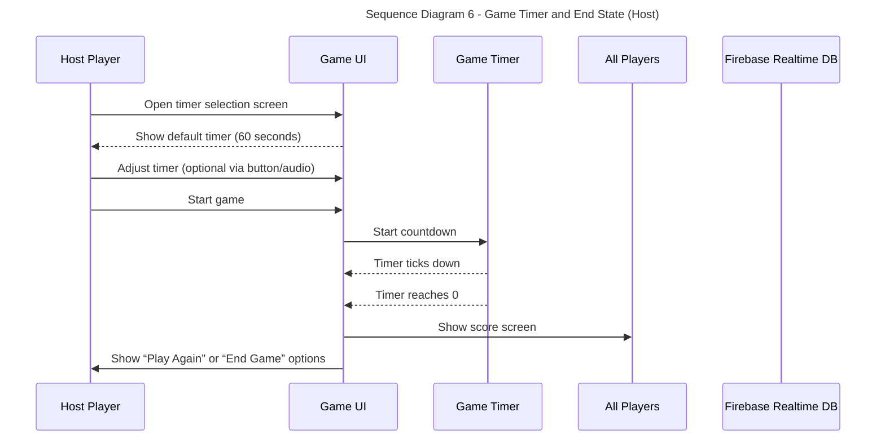
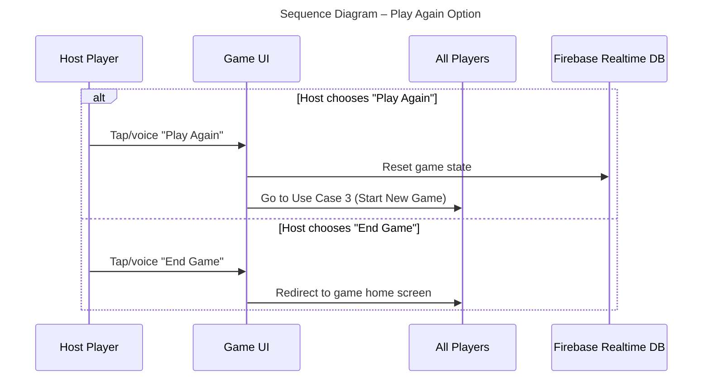

# Sequence Diagrams

## Use Case 1 - Start Game Session (Host Player) 
*As a player, I want to initiate a new game session from my device, acting as the host, so that other players can join and I can control the game session. *
1. The Host Player opens their Host Interface and authenticates with the Auth Service (Firebase), navigating to the session creation screen.
2. The Host Player selects the "Create Session" or "Host Game" control on their Host Interface.
3. The Host Interface sends a request to the Game Server to create a new game session, identifying itself as the session host.
4. The Game Server generates a unique Room Code, registers the Host Player, initializes the game state to "Lobby," and updates its internal lobby management.
5. The Game Server sends the generated Room Code back to the Host Interface.
6. The Host Interface displays the unique Room Code.
7. The Host Player communicates or shows the Room Code to nearby players.
8. The Host Interface shows a "Waiting for Players" screen.
9. AAC Device Identification: Separately, the AAC Interface (Hippo_Player_App on AAC user's device) indicates to the Game Server that it is the designated AAC device for the session. This allows the Game Server to properly direct AAC-specific game state and process AAC user inputs.
    

## Use Case 2 – Join Game Session (Player or AAC User)
*As a player or AAC User, I want to join a game session using a code so that I can play the game.*

1. A player opens the game/ website on their device.
2. They enter the room code or use the audio provided by the host.
3. They tap “Join Game” or use audio.
4. Once the code is accepted, they are added to the game lobby.
5. The player waits until the host starts the game.

## Use Case 3 – Start Game (Host)
*As a host, I want to start the game after players have joined so that everyone can begin playing.*

1. The Host Player sees a "Start Game" button on their game interface.
2. The Host Player taps "Start Game".
3. The Host Player's interface sends a command to Firebase to start the game.
4. Firebase updates the central game state to begin a 3-second countdown.
5. All connected player interfaces (Host, AAC User, and other players) receive the updated game state and switch to a gameplay screen, displaying the countdown.
6. When the countdown ends, the game officially starts, and gameplay begins on all connected screens.

## Use Case 4 – Control Fruit Queue (AAC User)

*As an AAC user, I want to control the next three fruits in the queue so that I can challenge players.*

1. During gameplay, the AAC interface shows options for fruits to appear.
2. The AAC user selects the next fruit from a set of fruit buttons.
3. The selected fruit is queued to drop into the play area.
4. The next 1 fruit is visible on screen to all players.

## Use Case 5 – Eats Fruit (Player)

*As a player, I want to move my hippo around the arena and eat the correct fruit so that I can earn points.*

1. Fruits spawn and are placed randomly across the arena in real time.
2. The player watches the displayed queue to know which fruit is “correct.”
3. The player moves their hippo toward the fruits on the arena.
4. If correct, a point is awarded.
5. If incorrect, no point is awarded (or a penalty is applied).

## Use Case 6 – Game Timer and End State (Host)
*As a player or AAC user, I want the game to end automatically after 1 minute so we know when the round is over.*

1. The host sees a timer selection screen.
2. There is a 60-second default timer. The host can use buttons or audio to change the time.
3. The host starts the game. See User Case 3.
4. When the timer reaches 0, the game ends.
5. A score screen is shown to all players.
6. The host sees a “Play Again” or “End Game” option.

## Use Case 7 – Play Again (AAC User or Player)
*As an AAC user or player, I want to play another game session after a round ends.*

1. After the game ends, if the host taps or uses audio to “Play Again”, go to Use Case 3.
2. If the host taps or uses audio to “End Game”, all users are redirected to the game homescreen.

