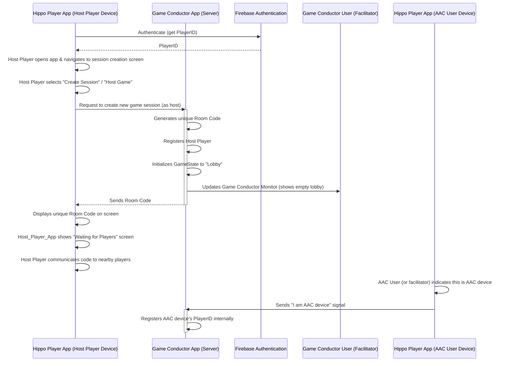
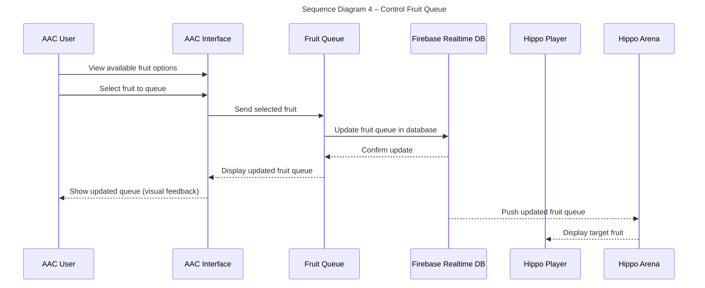
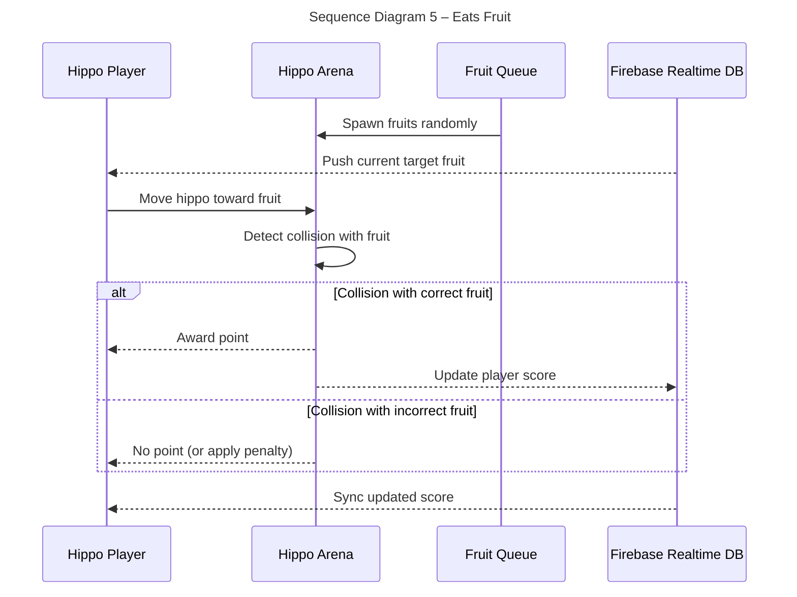

# Sequence Diagrams

## Use Case 1 - Start Game Session (Host Player) 
*As a player, I want to initiate a new game session from my device, acting as the host, so that other players can join and I can control the game flow. *
1. The Host Player opens the Hippo Player App on their device and, after successful authentication via Firebase, navigates to the session creation screen.
2. The Host Player selects the "Create Session" or "Host Game" control within their Hippo Player App interface.
3. The Hippo Player App sends a request to the Game Conductor App (server) to create a new game session, identifying itself as the session host.
4. The Game Conductor App generates a unique Room Code for the session, registers the Host Player, initializes the game state to "Lobby," and updates its internal lobby management.
5. The Game Conductor App sends the generated Room Code back to the Host Player's Hippo Player App.
6. The Host Player's Hippo Player App displays the unique Room Code clearly on their screen.
7. The Host Player communicates or shows the Room Code to nearby players.
8. The Game Conductor App updates the Game Conductor Monitor to show the active lobby and connected players. The Host Player's Hippo Player App shows a "Waiting for Players" screen.
9. AAC Device Identification: Separately (either upon launch of their Hippo Player App or via a specific in-app selection by a facilitator), the Hippo Player App on the AAC user's device indicates to the Game Conductor App that it is the designated AAC device for the session. This allows the Game Conductor App to properly direct AAC-specific game state (like current viewport fruits for selection) and process AAC user inputs.

    
## Use Case 4 – Control Fruit Queue (AAC User)

*As an AAC user, I want to control the next three fruits in the queue so that I can challenge players.*

1. During gameplay, the AAC interface shows options for fruits to appear.
2. The AAC user selects the next fruit from a set of fruit buttons.
3. The selected fruit is queued to drop into the play area.
4. The next 1 fruit is visible on screen to all players.

## Use Case 5 – Eats Fruit (Player)

*As a player, I want to move my hippo around the arena and eat the correct fruit so that I can earn points.*

1. Fruits spawn and are placed randomly across the arena in real time.
2. The player watches the displayed queue to know which fruit is “correct.”
3. The player moves their hippo toward the fruits on the arena.
4. If correct, a point is awarded.
5. If incorrect, no point is awarded (or a penalty is applied).

